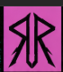

# Rhythmic Ritual ◉ AENIMAL

## Concept: "Mechanical Jungle"
Rhythmic Ritual is the spiritual successor to the legendary **Animinimals** (Hasselt Zoo). A 6-edition underground club series blending Techno, Psytrance, Disco, and Groovy rhythms.

### Edition 01: AENIMAL
- **Venue**: T Schuurke, Vlijtingen
- **Theme**: Cyberpunk / Jungle / Animals / Reverse-Engineered Transformers / Crypto
- **Goal**: "Welcomed Home" - An inclusive space for all ages.

## Project Structure
- `01_BrandStrategy`: Campaign goals, legacy docs, and legal.
- `02_SocialMedia`: Content calendars and phase plans.
- `03_Design`: Logos, flyers, posters, and merch tech-packs.
- `04_Music`: DJ lineups and playlists.
- `06_Automation`: AI prompts and design scripts.

---
*Vlijtingen ➔ Berlin*
